# Learning QARMA

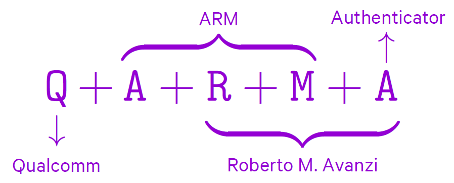

 

## Tweakable Block Cipher

> In addition to the secret key and a plaintext or ciphertext, **TBCs accept a third input, the tweak, which is public. The tweak and key together select the permutation computed by the cipher.**

调柄(tweak)其作用类似于CBC中的初始向量，更换tweak就可以改变密文结果，并且改变tweak的代价很低

- *在AES中修改秘钥的代价是昂贵的，但如果仅改变部分，则会有安全问题【Related Key Attack】*

> **ECB** preserves a lot of the structure of the plaintext in the ciphertext.
>
> Among alternatives that hide the structure of the plaintext, for performance reasons a parallelisable mode is preferred. A common choice is represented by **counter based modes**, which turn the block cipher into, essentially, a **stream cipher**.
>
> However, these modes **require extra memory** for the nonces and are difficult to properly implement in several contexts since they **need a good source of entropy**. **If nonces are reused, these modes break completely.**

It is desirable to have memory encryption primitives that provide some level of nonce misuse resistance, or can even work without any memory expansion.

We consider modes that employ direct encryption, where the permutation depends on **a tweak that can be the physical address of the block being encrypted**, and/or **an additional nonce or counter if memory expansion is allowed**.

A tweakable cipher is secure if it cannot be broken **even assuming the adversary has full tweak control**. Hence, designing a TBC is a difficult task as care must be taken in how the user-controlled tweak is included in the design.

## About QARMA

QARMA is a family of **hardware-oriented lightweight TBCs**. QARMA is chiefly meant to be deployed in **fully unrolled or pipelined hardware implementations**. **In particular, its design is not intended to facilitate round-based implementations.** QARMA targets use cases such as `memory encryption`, and `short tags for software security`.

There are two variants of QARMA that support blocks sizes of **n = 64** and **n = 128** bits, denoted by **QARMA-64** and **QARMA-128**, respectively. The **tweak is also n bits** long and the **key is always 2n bits** long. 

> The proposal of a simple technique to extend the length of the tweak of a block cipher that has only a fixed length tweak. The idea consists in **using a universal hash function to compress a longer tweak onto the available size.** 

This idea may seem counterintuitive, as it introduces an additional computational cost to change the tweak. **However, in practice the resulting construction may be more efficient than increasing the number of rounds of the cipher to include a longer tweak while maintaining the same security level.** While this line of research seems promising, it needs more analysis.

## Specification of QARMA

### General Definitions and Notation

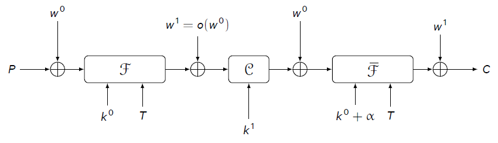

QARMA is a **three-round Even-Mansour construction** where the permutations are parameterized by **a core key**, and **the key mixings between rounds are derived from a whitening key**.

The first and third permutations are **functionally the inverse of each other** and are further **parameterized by a tweak**.

The central permutation is designed to be easily inverted by means of a simple transformation of the key.

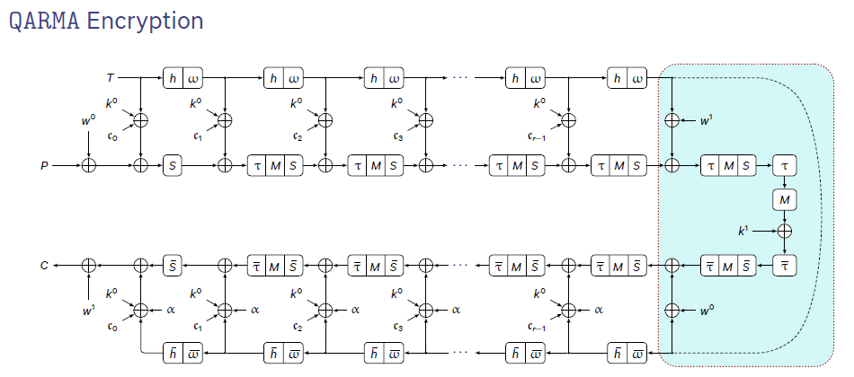

- The letters P, C and T denote the plaintext, the ciphertext and the tweak;
- The keys k 0 , k1, w0, and w1 are derived from a master key K via a simple key specialisation. 
- S represents a layer of sixteen m-bit S-Boxes, h and τ are permutations;
- M and Q are MixColumns-like operations, with Q involutory;
- ω is a LFSR.

Write n = 16m with m = 4 or 8. All n-bit values are represented as arrays of **sixteen m-bit cells**. **Cells are indexed in big endian order while the bits inside a cell are ordered in little endian order**.

>  *For QARMA-64, bits 63..60 are contained in the zeroth cell, and bits 3..0 in in the fifteenth cell.*

Any array of sixteen cells is also viewed as a 4 × 4 matrix, for instance, the internal state admits representations, so that 4 × 4 matrices operate column-wise on these values by left multiplication. The plaintext is given as P = p0||p1 ||· · · ||p14||p15, the tweak as T = t0||t1 ||· · · ||t14||t15.

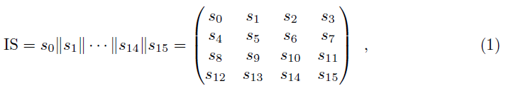

### Key Specialisation

The 2 n = 32m-bit key K is first partitioned as w0||k0 where  w0 and k0, the ***whitening*** and ***core*** keys, are 16m bits each.

For encryption, put w1 = o(w0) := (w0 >>> 1) + (w0 >> (16m − 1)) and k1 = k0.

Since the first r rounds of the cipher (ignoring initial whitening) differ from last r rounds solely by the addition of a non-zero constant α, the encryption circuit can be used for decryption when k0 + α is used as the core key, the whitening keys w0 with w1 are swapped, and k1 = Q · k0.

### The Forward Round Function

The Forward Round Function R(IS; tk) is composed by four operations, performed in the following order:

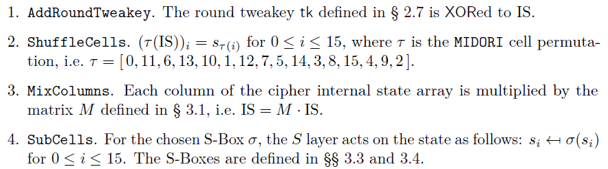

​	*The symbol tk denotes a (round) tweakey, i.e. a value derived only from the key, the tweak, and the round constants.*

A short version of the forward round function exists which omits the **ShuffleCells** and **MixColumns** operations, similarly to the AES final round.

### The Tweak Update Function

First, the cells of the tweak are permuted as h(T) = th(0) ||· · · ||th(15), where h is the same permutation h = [ 6, 5, 14, 15, 0, 1, 2, 3, 7, 12, 13, 4, 8, 9, 10, 11 ] used in *MANTIS*.

**Then, a LFSR ω updates the tweak cells with indexes 0, 1, 3, 4, 8, 11, and 13.** For m = 4, ω is a maximal period LFSR that maps cell (b3, b2, b1, b0) to (b0 +b1, b3, b2, b1). For m = 8, it maps cell (b7, b6, . . . , b0) to (b0 +b2, b7, b6, . . . , b1), and its cycles on the non-zero values have all length 15 or 30.

### The Backward Round Function

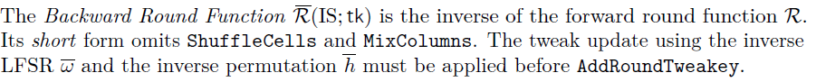

### The Central Construction and the Pseudo-Reflector

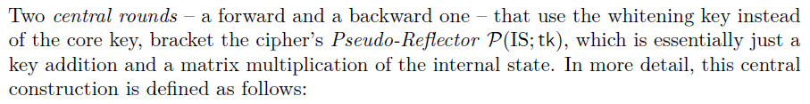

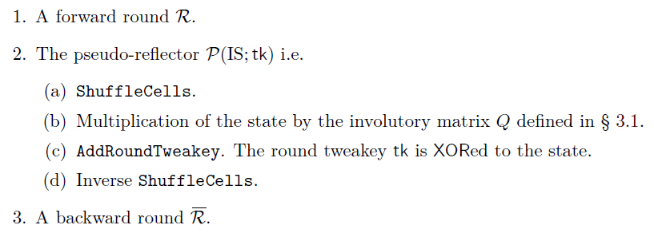

### The Encryption and Decryption Algorithm

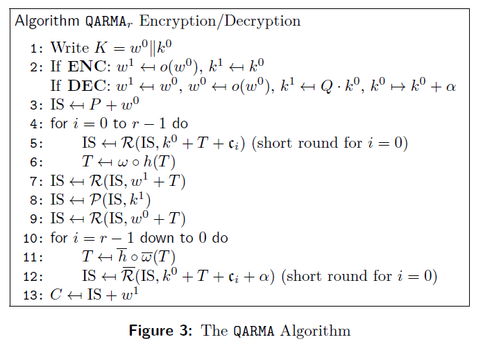

The encryption algorithm of **QARMAr** has 2 r + 2 rounds.

The round constants are derived from the expansion of the constant π. 

* For the 64-bit version of QARMA we replace the first block of sixteen digits of the fractional part with
  zeros and select the seventh block as the α constant.
* For the 128-bit cipher, instead, we just take the first block of 128 bits in the fractional part of π as the α constant, set c0 = 0, and then each ci is a successive block 128 bits of π.

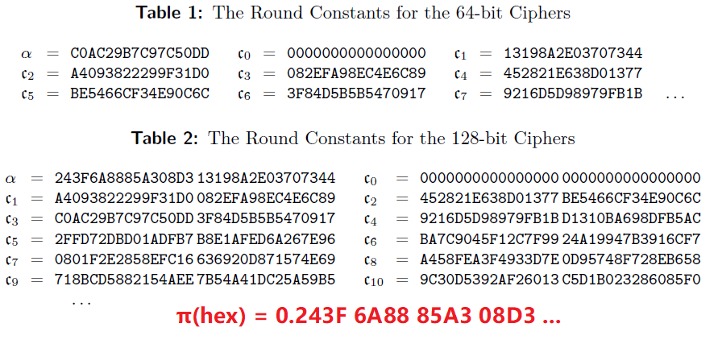

### Parameters

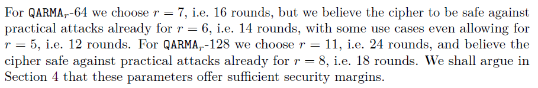

### The Diffusion Matrices

Choose the matrix M4,2 = Q4,2 for QARMA-64, and the matrix M8,2 = Q8,2 for QARMA-128.

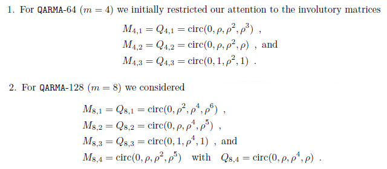

